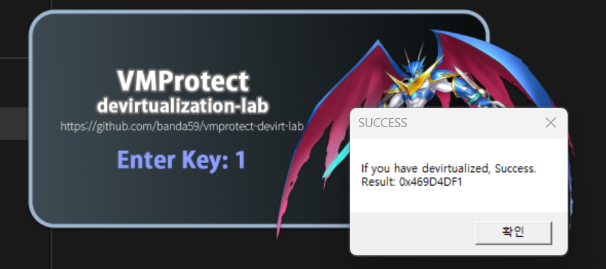

# VMProtect Devirtualization Challenges



> Practice binaries for learning and experimenting with VMProtect devirtualization.  
> Each sample is intentionally simplified so you can focus on understanding the virtualization layer and removing it cleanly.

---

## Targets

| File | Architecture |
|------|-------------|
| `(Lv01)-chall-x64.exe` | x86-64 (64-bit) |
| `(Lv01)-chall-x86.vmp.exe` | x86 (32-bit) |

> More levels will be introduced over time.

---

## 🎯 General Objective

For each level:

- Identify the virtualized function
- Recover its original native logic
- Patch the binary so execution no longer goes through the VMProtect interpreter
- Preserve the original program behavior

The goal is **not** to change functionality, but to **remove the VM layer** while keeping the same result.

---

## Level 01 — Overview

When executed, the program displays a simple window.

**Active keys:**

| Key | Action |
|-----|--------|
| `1` | Execute the protected `verify_key` function |
| `ESC` | Exit |

If the expected result is produced, a success dialog is shown:

```
If you have devirtualized, Success!
Result: 0x469D4DF1
```

> The original binary also prints this message because the VM engine executes the correct logic.  
> Your task is to **replace the VM entry with recovered native code** so the same result is produced **without executing the VM interpreter**.

---

## ⚠️ Security Notice

These binaries use **VMProtect**, a commercial software protection tool.  
Because of this, some security software (Windows Defender, antivirus) or dynamic analysis tools such as **Intel Pin** may flag them or refuse to open them.

**These files are safe.** They are intentionally crafted challenge binaries for educational purposes only.

If you are unsure or uncomfortable running them on your host machine:

- It is perfectly fine — and even recommended — to solve these challenges **inside a virtual machine** (e.g., VMware, VirtualBox, or Windows Sandbox)
- Temporarily disabling real-time protection for the challenge directory is also an option if you trust the source

---

## 📝 Disclaimer

These binaries are provided for **educational and research purposes only**.  
Do not use techniques learned here for unauthorized access or malicious activity.

---

*Made by [@banda](https://github.com/banda59)*