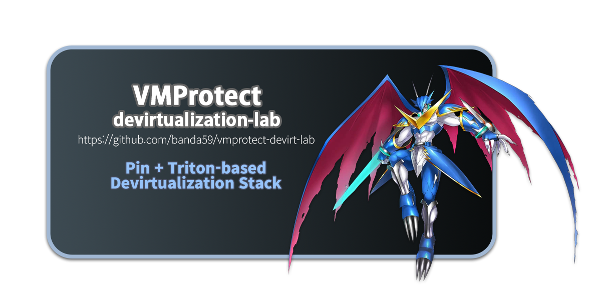

# VMP-DEVIRT-LAB



A research-driven toolchain for dynamically tracing, semantically analyzing, and devirtualizing binaries protected by VMProtect 3. This project is the practical implementation that grew out of hands-on research into VMProtect's virtualization internals, documented in the writeup [VMProtect Devirtualization: Part 2](https://hackyboiz.github.io/2025/12/11/banda/VMPpart2/en/).

---

## Background

VMProtect's virtualization protection works by converting original x86/x64 code into a proprietary bytecode format and embedding a custom software virtual machine (VM) inside the binary that interprets it at runtime. Rather than executing native machine instructions directly, the protected function is replaced with a VM entry stub that hands control to this interpreter.

The core challenge of devirtualization is that the VM deliberately obscures every layer of this process: the dispatcher is heavily flattened, each handler is buried under junk instructions and opaque predicates, and the bytecode is encrypted. Standard debugger-based analysis quickly becomes impractical because you end up chasing an endless `handler -> dispatcher -> handler -> ...` loop with no clear semantic output at each step.

The approach taken in this project, and the research it is based on, treats devirtualization as a pipeline of four distinct problems:

1. **Locating the VM entry** — finding where native code hands off control to the VM dispatcher
2. **Tracing execution** — collecting a complete, per-instruction log of what the VM actually does at runtime, bypassing obfuscation entirely via dynamic binary instrumentation (Intel Pin)
3. **Extracting handler semantics** — for each unique handler, determining what transformation it applies to the VM state (registers, virtual stack, flags), using pattern clustering and symbolic execution (Triton)
4. **Code reconstruction and patching** — translating the recovered semantics back into native x86/x64, assembling it with Keystone, and patching the binary so that the VM entry jumps directly to the restored code

VMP-DEVIRT-LAB provides tooling for all four stages.

---

## Repository Structure

```
VMP-DEVIRT-LAB/
├── devirtualize-test/
│   ├── [level01-x64] vmp-lab.vmp.exe   # 64-bit challenge binary
│   └── [level01-x86] vmp-lab.vmp.exe   # 32-bit challenge binary
├── image/
│   └── vmp-lab.png
├── pin/
│   ├── extras/
│   ├── ia32/
│   ├── intel64/
│   ├── source/
│   ├── vmp-devirt-lab/
│   │   ├── MyPinTool.cpp       # Pin tool source (x86 & x64)
│   │   ├── obj-ia32/           # Pre-built x86 (32-bit) DLL
│   │   └── obj-intel64/        # Pre-built x64 (64-bit) DLL
│   └── pin.exe
├── devirtualizer.py      # x86/x64 code reconstruction and binary patcher
├── TraceAnalyze.py       # Trace parsing, handler profiling, and Triton-based semantic extraction
└── readme.md
```

---

## Components

### MyPinTool.cpp — Intel Pin Dynamic Tracer

The Pin tool is the foundation of the entire pipeline. Regardless of how heavily the VM is obfuscated, Intel Pin instruments the binary at the CPU level, intercepting and logging every instruction that physically executes. No encryption, no junk instruction, no control-flow flattening can hide from it.

The tool begins recording when execution first reaches the specified VM entry address and continues until a configurable instruction limit is hit. For each handler address provided, it captures a bytecode-level log at handler dispatch time, including the current virtual register state.

**Output files:**

| File | Contents |
|---|---|
| `vmp_trace.txt` | Full instruction trace: `seq, ip, bytes` for every executed instruction |
| `vmp_bytecode.csv` | Per-handler dispatch log: `name, id, tid, seq, ip, bc_addr, bc_val, gax, gbx, gcx, gdx, gsi, gdi, gbp, sp` |
| `vmp_regs.txt` | Full register dumps at VM entry and at each handler boundary |
| `vmp_mem.csv` | Optional memory read/write log with address, size, and optionally value |
| `vmp_analysis.txt` | Aggregated handler call counts, control-flow edge statistics, auto-detected handler candidates |

The register values in the bytecode CSV use Pin's generic register names (`gax`, `gbx`, ...) which automatically resolve to either 32-bit (`eax`, `ebx`, ...) or 64-bit (`rax`, `rbx`, ...) depending on the target architecture.

**Auto-detection mode** (`-auto 1`) monitors jump and call targets during the trace and identifies frequently-reached addresses as handler candidates — useful when you have the VM entry but have not yet identified any handler addresses.

**Pre-built binaries:**

| Directory | Target Architecture |
|---|---|
| `pin/vmp-devirt-lab/obj-ia32/` | x86 (32-bit) |
| `pin/vmp-devirt-lab/obj-intel64/` | x64 (64-bit) |

**Build from source (optional):**

```
# From pin/vmp-devirt-lab/
make PIN_ROOT=../.. TARGET=ia32      # -> obj-ia32/MyPinTool.dll
make PIN_ROOT=../.. TARGET=intel64   # -> obj-intel64/MyPinTool.dll
```

**Usage — x86 target:**

```
pin.exe -t pin\vmp-devirt-lab\obj-ia32\MyPinTool.dll ^
    -entry 0x<vm_entry_va>                           ^
    -handlers 0x<handler1>,0x<handler2>,...          ^
    -o vmp_trace.txt                                 ^
    -bc vmp_bytecode.csv                             ^
    -regs vmp_regs.txt                               ^
    -analysis vmp_analysis.txt                       ^
    [-trackmem 1 -mem vmp_mem.csv [-memval 1]]       ^
    [-auto 1] [-max <N>] [-v 1]                      ^
    -- target_x86.exe
```

**Usage — x64 target:**

```
pin.exe -t pin\vmp-devirt-lab\obj-intel64\MyPinTool.dll ^
    -entry 0x<vm_entry_va>                              ^
    -handlers 0x<handler1>,0x<handler2>,...             ^
    -o vmp_trace.txt                                    ^
    -bc vmp_bytecode.csv                                ^
    -regs vmp_regs.txt                                  ^
    -analysis vmp_analysis.txt                          ^
    [-trackmem 1 -mem vmp_mem.csv [-memval 1]]          ^
    [-auto 1] [-max <N>] [-v 1]                         ^
    -- target_x64.exe
```

**Knob reference:**

| Knob | Default | Description |
|---|---|---|
| `-entry` | — | VM entry point virtual address (hex, required) |
| `-handlers` | — | Comma-separated handler addresses (hex) |
| `-o` | `vmp_trace.txt` | Instruction trace output |
| `-bc` | `vmp_bytecode.csv` | Bytecode/handler CSV output |
| `-regs` | `vmp_regs.txt` | Register snapshot log |
| `-mem` | `vmp_mem.csv` | Memory access log |
| `-analysis` | `vmp_analysis.txt` | Aggregate analysis output |
| `-trackmem` | `0` | Enable memory tracking (0/1) |
| `-memval` | `0` | Include memory read/write values (0/1) |
| `-auto` | `0` | Auto handler candidate detection (0/1) |
| `-max` | `0` | Max instructions to record (0 = no limit) |
| `-v` | `0` | Verbose console output (0/1) |
| `-h_tool 1` | — | Print usage and exit |

---

### TraceAnalyze.py — Trace Parser and Semantic Analyzer

Once trace files are collected, `TraceAnalyze.py` provides two analysis modes. The first gives you a quick orientation of what the trace contains; the second goes deeper and attempts to answer the hard question: what does this handler actually do?

**Dependencies:**

```
pip install capstone
pip install triton-library   # optional, required for semantics subcommand
```

#### `summary` — Trace Overview

```
python TraceAnalyze.py summary \
    --trace vmp_trace.txt      \
    --bytecode vmp_bytecode.csv \
    [--mem vmp_mem.csv]         \
    [--save-json out.json]
```

Outputs instruction count, address range, auto-detected architecture (x86 or x64), and a table of unique handler IPs sorted by call frequency with their bytecode value distributions. This is the first step after collecting a trace — it tells you which handlers are worth analyzing and which are just dispatcher glue.

Each handler's bytecode pattern is classified as one of three kinds:

- `pure_const` — always dispatched with the same bytecode value; likely a single fixed-purpose operation
- `biased_const` — one value dominates, with occasional variation; possibly a multi-form handler
- `mixed` — wide variety of bytecode values; typically an operand-carrying handler such as a constant loader or memory access

The dispatcher itself appears at very high call frequency but has no interesting semantics. Addresses that appear at the top of the frequency list and are also known jump/call targets across many handler boundaries are strong dispatcher candidates and can be excluded from further analysis.

#### `semantics` — Handler Semantic Extraction via Triton

```
python TraceAnalyze.py semantics        \
    --trace vmp_trace.txt               \
    --bytecode vmp_bytecode.csv         \
    --arch auto                         \
    [--handler-ips 0x<h1>,0x<h2>,...]   \
    [--max-handlers 32]                 \
    [--max-insts 200]                   \
    [--out-json semantics.json]         \
    [-v]
```

For each handler, this subcommand uses Triton's symbolic execution engine to process the instruction trace and compute:

- **Input and output registers** — which registers are read before the handler runs, and which are written by it
- **Net stack delta** — how much the virtual stack pointer moves per invocation
- **Memory access patterns** — reads and writes, including address expressions relative to ESP/RSP
- **Output formulas** — simplified symbolic expressions for each modified register, e.g. `(eax + ebx)`, `(ecx ^ 0x4acb3db9)`, `(ror(eax, 1))`
- **Operation class** — one of: `arithmetic`, `logic`, `memory_load`, `memory_store`, `stack_push`, `stack_pop`, `const_store`, `control_flow`, `register_op`
- **Best-guess x86 equivalent** — a heuristic attempt to name the native instruction this handler corresponds to

Results are written to `semantics.json` and consumed by `devirtualizer.py`.

**Polymorphic handler clustering** (`cluster_handlers_by_semantics`) groups handlers that share identical semantic signatures — same operation class, same I/O register sets, same stack delta, same memory access counts — even if they sit at different addresses or contain different junk instruction sequences. VMProtect commonly generates multiple polymorphic copies of the same logical handler to defeat simple address-based pattern matching, and this clustering identifies and consolidates them before code reconstruction.

---

### devirtualizer.py — Code Reconstructor and Binary Patcher

The final stage. Takes the Pin tool output and Triton semantics, maps each VM bytecode instruction to a native x86/x64 assembly template, assembles the result with Keystone, and patches it back into the binary at the VM entry's file offset.

**Dependencies:**

```
pip install keystone-engine
pip install capstone
```

**Usage:**

```
python devirtualizer.py                    \
    --orig target.exe                      \
    --trace vmp_trace.txt                  \
    --bytecode vmp_bytecode.csv            \
    [--semantics semantics.json]           \
    [--clusters clusters.json]             \
    --image-base 0x<base>                  \
    --vm-entry 0x<vm_entry_va>             \
    --out target_devirt.exe                \
    --arch x86
```

| Argument | Description |
|---|---|
| `--orig` | Original protected binary |
| `--trace` | `vmp_trace.txt` from Pin tool |
| `--bytecode` | `vmp_bytecode.csv` from Pin tool |
| `--semantics` | `semantics.json` from `TraceAnalyze.py` (strongly recommended) |
| `--clusters` | `clusters.json` for polymorphic handler grouping (optional) |
| `--image-base` | PE image base address (default `0x400000` for x86, `0x140000000` for x64) |
| `--vm-entry` | VM entry point VA (hex, required) |
| `--out` | Output patched binary |
| `--arch` | `x86` or `x64` |

**Internal pipeline:**

The `_semantic_to_x86()` function is the core of the reconstruction step. It takes a handler's semantic record from Triton — operation class, input/output registers, output formulas — and selects an appropriate x86 assembly template. When Triton produced an explicit `x86_equivalent` string (e.g. `"add eax, ebx"`), that is used directly. Otherwise, the function applies a set of heuristics: a `stack_push` with one input register becomes `push <reg>`, a `const_store` becomes `mov eax, IMM32`, an `arithmetic` handler with a `+` in its formula becomes `add`, and so on.

The full reconstruction pipeline runs as follows:

1. Load handler-to-semantics mappings from `semantics.json`
2. Parse the bytecode event log from `vmp_bytecode.csv` and align events to the instruction trace
3. For each VM bytecode dispatch event, look up the handler semantics and emit the corresponding x86 template
4. Identify control flow candidates — adjacent instruction pairs where the handler class is `control_flow` — as a basis for branch reconstruction
5. Optimize the generated instruction sequence (dead code elimination, redundant move removal)
6. Assemble all templates into machine code using Keystone
7. Resolve the VM entry RVA to a file offset by parsing the PE section table directly (no external PE library required)
8. Patch the binary: if the recovered code fits within 1024 bytes, overwrite the VM entry stub inline and pad the remainder with `NOP`; otherwise, flag for a new-section strategy
9. Write a `.report.txt` alongside the patched binary summarizing handler mappings, call counts, and the first 50 reconstructed instructions

---

## Full Workflow

### Step 0 — Finding the VM Entry

Before running anything, you need the VM entry point address. This is the address where VMProtect's dispatcher takes control — typically a short push/call stub that immediately enters a heavily obfuscated block.

In IDA or Binary Ninja, the VM entry is usually the last address that the decompiler can handle before showing `call analysis failed`. In a debugger, set a breakpoint on the protected function and single-step until the disassembly window fills with a repeating `mov reg, [esi]` / `add esi, N` pattern — you are inside the bytecode fetch loop, which means the address just before that is the VM entry.

Once you have that address, proceed:

### x86 (32-bit) Workflow

```
# Step 1: First pass with auto-detection to discover handler candidates
pin.exe -t pin\vmp-devirt-lab\obj-ia32\MyPinTool.dll ^
    -entry 0x<vm_entry> -auto 1                      ^
    -o vmp_trace.txt -bc vmp_bytecode.csv            ^
    -analysis vmp_analysis.txt                       ^
    -- "[level01-x86] vmp-lab.vmp.exe"

# Review vmp_analysis.txt -> recommended_handlers_option
# This section contains a pre-formatted -handlers argument
# listing addresses that were frequently jumped or called into

# Step 2: Second pass with explicit handler list for a complete annotated trace
pin.exe -t pin\vmp-devirt-lab\obj-ia32\MyPinTool.dll         ^
    -entry 0x<vm_entry>                                       ^
    -handlers 0x<h1>,0x<h2>,0x<h3>,...                       ^
    -o vmp_trace.txt -bc vmp_bytecode.csv -regs vmp_regs.txt ^
    -trackmem 1 -mem vmp_mem.csv                             ^
    -analysis vmp_analysis.txt                               ^
    -- "[level01-x86] vmp-lab.vmp.exe"

# Step 3: Inspect the trace — understand handler call frequency and bytecode patterns
python TraceAnalyze.py summary \
    --trace vmp_trace.txt      \
    --bytecode vmp_bytecode.csv

# Step 4: Extract handler semantics via Triton symbolic execution
python TraceAnalyze.py semantics        \
    --trace vmp_trace.txt               \
    --bytecode vmp_bytecode.csv         \
    --arch x86                          \
    --out-json semantics.json

# Step 5: Reconstruct native code and patch the binary
python devirtualizer.py                    \
    --orig "[level01-x86] vmp-lab.vmp.exe" \
    --trace vmp_trace.txt                  \
    --bytecode vmp_bytecode.csv            \
    --semantics semantics.json             \
    --image-base 0x400000                  \
    --vm-entry 0x<vm_entry>                \
    --out vmp-lab_devirt_x86.exe           \
    --arch x86
```

### x64 (64-bit) Workflow

```
# Step 1: Auto-detect handlers
pin.exe -t pin\vmp-devirt-lab\obj-intel64\MyPinTool.dll ^
    -entry 0x<vm_entry> -auto 1                         ^
    -o vmp_trace.txt -bc vmp_bytecode.csv               ^
    -analysis vmp_analysis.txt                          ^
    -- "[level01-x64] vmp-lab.vmp.exe"

# Step 2: Explicit handler trace
pin.exe -t pin\vmp-devirt-lab\obj-intel64\MyPinTool.dll      ^
    -entry 0x<vm_entry>                                       ^
    -handlers 0x<h1>,0x<h2>,0x<h3>,...                       ^
    -o vmp_trace.txt -bc vmp_bytecode.csv -regs vmp_regs.txt ^
    -trackmem 1 -mem vmp_mem.csv                             ^
    -analysis vmp_analysis.txt                               ^
    -- "[level01-x64] vmp-lab.vmp.exe"

# Step 3: Trace summary
python TraceAnalyze.py summary \
    --trace vmp_trace.txt      \
    --bytecode vmp_bytecode.csv

# Step 4: Semantic extraction
python TraceAnalyze.py semantics        \
    --trace vmp_trace.txt               \
    --bytecode vmp_bytecode.csv         \
    --arch x64                          \
    --out-json semantics.json

# Step 5: Patch
python devirtualizer.py                    \
    --orig "[level01-x64] vmp-lab.vmp.exe" \
    --trace vmp_trace.txt                  \
    --bytecode vmp_bytecode.csv            \
    --semantics semantics.json             \
    --image-base 0x140000000               \
    --vm-entry 0x<vm_entry>                \
    --out vmp-lab_devirt_x64.exe           \
    --arch x64
```

---

## Devirtualize-Test Challenges

The `devirtualize-test/` directory contains binaries built with VMProtect Demo for Windows version 3.10.3, with virtualization applied and no other protections enabled. They exist so you can practice the complete pipeline on a known, controlled target before attempting real-world samples.

### Level 01

| File | Architecture |
|---|---|
| `[level01-x64] vmp-lab.vmp.exe` | x86-64 |
| `[level01-x86] vmp-lab.vmp.exe` | x86 (32-bit) |

**Program behavior**

When launched, the binary renders an image window. Two keys are active:

- `ESC` — close the program
- `1` — invoke the internal `verify_key` function

`verify_key` is the function protected by VMProtect virtualization. When it computes the expected result, a success message is printed.

**Objective**

Analyze the virtualized `verify_key` function, recover its original logic, and patch the binary so that the devirtualized code runs in place of the VMProtect interpreter. If the patch is correct, pressing `1` will still produce the success message — without going through the VM engine.

**Success condition**

When `1` is pressed in the patched binary:

```
If you have devirtualized, Success.
```

Note: the original unpatched binary also prints this message when `1` is pressed, because the VM itself executes the correct logic. The goal is to replace the VM entry stub with recovered native code and verify that the patched binary still reaches the same result without going through the VMProtect interpreter.

More levels with additional VMProtect protection layers (mutation, obfuscation, anti-debug) are planned for future releases.

---

## Requirements

| Component | Version / Note |
|---|---|
| Intel Pin | 3.x — SDK included under `pin/` |
| Python | 3.8 or later |
| keystone-engine | `pip install keystone-engine` — required for `devirtualizer.py` |
| capstone | `pip install capstone` — required for `TraceAnalyze.py` and `devirtualizer.py` |
| Triton | `pip install triton-library` — optional; required for `semantics` subcommand |
| OS | Windows — Pin tool instruments Windows PE binaries |

---

## References
I am deeply grateful to the references that provided invaluable guidance and support throughout my research!  
- [VMProtect Devirtualization: Part 2 — banda @ hackyboiz](https://hackyboiz.github.io/2025/12/11/banda/VMPpart2/en/) — the research writeup this project is based on
- [VMProtect Devirtualization: Part 1 — banda @ hackyboiz](https://hackyboiz.github.io/2025/09/11/banda/LLVM_based_VMP/ko/) — background on VMProtect internals and LLVM-based analysis
- [VMProtect-devirtualization — Jonathan Salwan](https://github.com/JonathanSalwan/VMProtect-devirtualization) — reference implementation that informed the Triton-based semantic analysis approach
- [Intel Pin — Dynamic Binary Instrumentation Tool](https://software.intel.com/content/www/us/en/develop/articles/pin-a-dynamic-binary-instrumentation-tool.html)
- [Triton — Dynamic Binary Analysis Framework](https://triton-library.github.io/)

---

## Author

banda